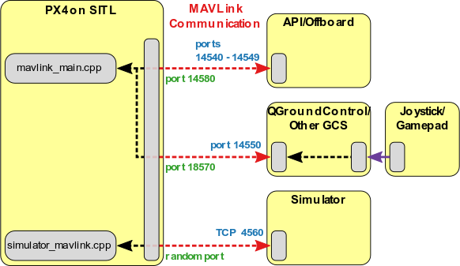

Iris
===================================

Note: Check if the path is set correctly using 'rospack find mavlink_sitl_gazebo'

 `source <https://docs.px4.io/main/en/dev_setup/getting_started.html>`_

PX4 utilizes the uORB message bus to facilitate communication among various modules and 
to establish connections with the external world, such as simulation or other hardware. It supports MAVLink and uXRCE-DDS.

As the current tutorials are based on ROS1, we employ MAVROS packages.
MAVROS enables MAVLink extendable communication between computers running ROS.

Availabel Services 
------------------------------
/mavros/cmd/arming
/mavros/cmd/command
/mavros/cmd/command_ack
/mavros/cmd/command_int
/mavros/cmd/land
/mavros/cmd/set_home
/mavros/cmd/takeoff
/mavros/cmd/trigger_control
/mavros/cmd/trigger_interval
/mavros/cmd/vtol_transition

Availabel modes in PX4
-----------------------------------
Multip copter

For manual control with hardware we will concentrate on autonomus mode for building further tutorials

https://docs.px4.io/main/en/flight_modes_mc/

Get the global and local position
Diff
global GPS data local is with respect to the start of the drone 

/mavros/global and /mavros/local

/mavros/setpoint* if in case you want to use PX4 planner completely

